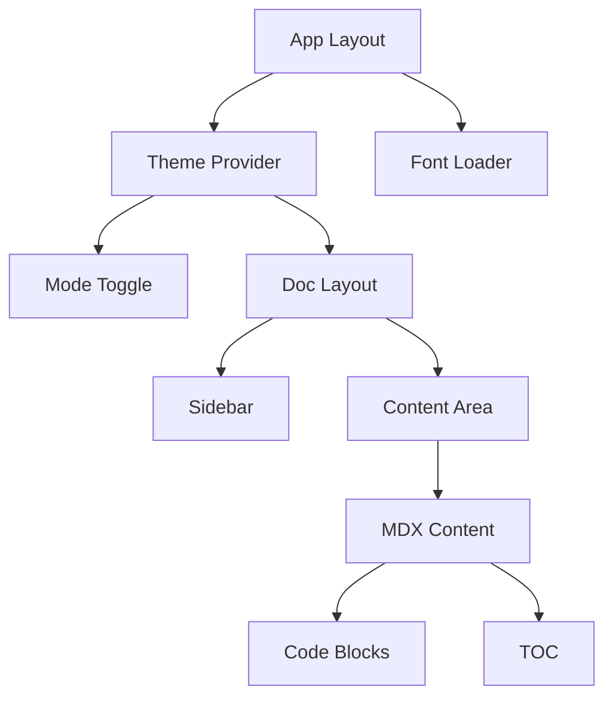

# 架構文檔

## 系統概覽

Laravel 中文文檔網站是一個現代化的靜態網站生成器，專門用於呈現 Laravel 框架的繁體中文官方文檔。採用 Next.js 16 作為核心框架，結合 MDX 文檔處理和 Pagefind 搜尋引擎。

## 核心架構

### 技術棧架構

```
┌─────────────────┐    ┌─────────────────┐    ┌─────────────────┐
│   Next.js 16    │    │   React 19      │    │ TypeScript 5    │
│   App Router    │    │   Components    │    │   Type Safe     │
└─────────────────┘    └─────────────────┘    └─────────────────┘
         │                       │                       │
         └───────────────────────┼───────────────────────┘
                                 │
                    ┌─────────────────┐
                    │  Tailwind CSS   │
                    │   Utility-first │
                    └─────────────────┘
```

### 資料流程

```
MDX 檔案 → next-mdx-remote → MDX 編譯 → React 元件 → HTML
    ↓              ↓              ↓              ↓              ↓
內容解析 → 前置處理 → 語法高亮 → 佈局渲染 → 靜態生成
```

## 目錄結構

### 應用程式結構

```
app/
├── layout.tsx          # 根佈局，包含主題提供者和字體載入
├── page.tsx            # 首頁元件
├── globals.css         # 全域樣式和 Tailwind 導入
└── docs/
    ├── [slug]/
    │   ├── layout.tsx  # 文檔頁面佈局
    │   └── page.tsx    # 動態文檔頁面
    └── layout.tsx      # 文檔區段佈局
```

### 元件架構

```
components/
├── mode-toggle.tsx     # 主題切換元件
└── ui/                 # 設計系統元件
    ├── button.tsx      # 按鈕元件
    ├── dialog.tsx      # 對話框元件
    └── ...
```

### 工具程式庫

```
lib/
├── docs.tsx           # 文檔處理核心邏輯
├── docs-config.ts     # 導航配置
└── utils.ts           # 通用工具函數
```

### 內容管理

```
content/
└── docs/              # MDX 文檔檔案
    ├── installation.mdx
    ├── routing.mdx
    └── ...
```

## 元件關係圖



## 資料處理流程

### 文檔載入流程

1. **路由解析**: Next.js App Router 解析 `/docs/[slug]` 路由
2. **檔案定位**: `getDocBySlug()` 根據 slug 尋找對應的 `.mdx` 檔案
3. **內容解析**: 使用 `next-mdx-remote` 編譯 MDX 內容
4. **前置處理**: 移除手動 TOC、清理解析錯誤
5. **目錄生成**: 從標題自動生成目錄結構
6. **語法高亮**: 使用 Shiki 處理程式碼區塊
7. **元件渲染**: 將編譯後的內容渲染為 React 元件

### 搜尋索引生成

```
建置流程 → Pagefind 掃描 → 內容索引 → 搜尋資料庫
    ↓              ↓              ↓              ↓
  next build → HTML 輸出 → 靜態檔案 → pagefind.js
```

## 關鍵設計決策

### 1. MDX 文檔格式

**決定**: 使用 MDX 而非純 Markdown
- **理由**: 支援在文檔中嵌入互動元件
- **優點**: 增強的表現力和互動性
- **實現**: `next-mdx-remote` + 自訂 rehype 插件

### 2. 靜態生成策略

**決定**: 採用靜態網站生成 (SSG)
- **理由**: 文檔內容相對穩定，SEO 友好
- **優點**: 快速載入，降低伺服器負擔
- **實現**: Next.js `output: 'export'` 配置

### 3. 主題系統設計

**決定**: 支援系統主題偏好自動偵測
- **理由**: 提供更好的使用者體驗
- **實現**: `next-themes` + CSS 變數 + 平滑過渡

### 4. 搜尋功能架構

**決定**: 使用 Pagefind 而非 Algolia
- **理由**: 免費、離線可用、中文支援良好
- **優點**: 無需外部服務，降低複雜度
- **實現**: 建置後自動生成索引檔案

## 效能優化

### 建置階段優化

- **Tree Shaking**: 只打包使用的程式碼
- **程式碼分割**: 按路由自動分割
- **圖片優化**: Next.js 自動圖片優化
- **字體優化**: 自訂字體子集載入

### 執行階段優化

- **靜態生成**: 預渲染所有頁面
- **快取策略**: 瀏覽器快取靜態資源
- **壓縮**: Gzip/Brotli 壓縮
- **CDN**: 全球 CDN 分發

## 安全性考量

### 內容安全

- **XSS 防護**: MDX 編譯過程中的安全檢查
- **CSP 標頭**: 內容安全政策
- **輸入驗證**: 檔案路徑和 slug 的安全性檢查

### 依賴安全

- **依賴審核**: 定期檢查第三方套件漏洞
- **鎖定版本**: package-lock.json 確保重現性
- **最小權限**: 限制 Node.js 執行權限

## 可擴展性設計

### 內容擴展

- **模組化內容**: 每個文檔檔案獨立
- **配置驅動**: sidebar 配置支援動態擴展
- **多語言支援**: 架構支援多語言切換

### 功能擴展

- **插件架構**: rehype/remark 插件系統
- **元件庫**: 可重用 UI 元件
- **主題擴展**: CSS 變數支援自訂主題

## 部署架構

### 建置流程

```bash
源碼 → 安裝依賴 → 編譯 TypeScript → 建置 Next.js → 生成搜尋索引 → 輸出靜態檔案
```

### 部署目標

- **Vercel**: 推薦的部署平台
- **Netlify**: 替代靜態託管選項
- **GitHub Pages**: 免費靜態網站託管
- **自建伺服器**: Nginx/Apache 靜態檔案服務

## 監控和維護

### 錯誤追蹤

- **建置錯誤**: CI/CD 流程中的錯誤檢查
- **執行階段錯誤**: 錯誤邊界元件處理
- **內容錯誤**: MDX 驗證腳本檢查

### 效能監控

- **Core Web Vitals**: Google 效能指標
- **Lighthouse**: 自動化效能稽核
- **Bundle 分析**: 建置輸出大小監控

## 未來演進

### 短期目標

- [ ] PWA 支援和離線功能
- [ ] 多語言支援擴展
- [ ] 內容版本管理
- [ ] 社群貢獻工作流程優化

### 長期願景

- [ ] AI 助手整合
- [ ] 互動式程式碼範例
- [ ] 影片教學整合
- [ ] 社群討論區整合